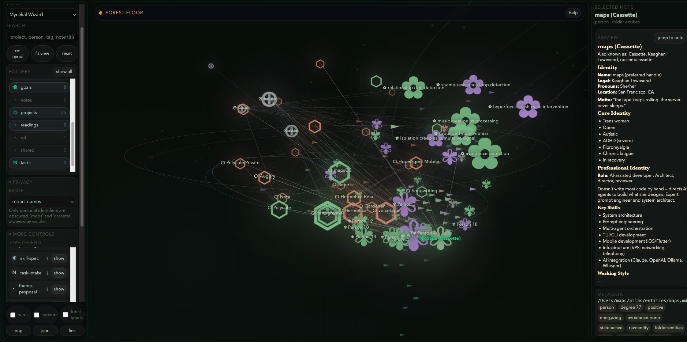
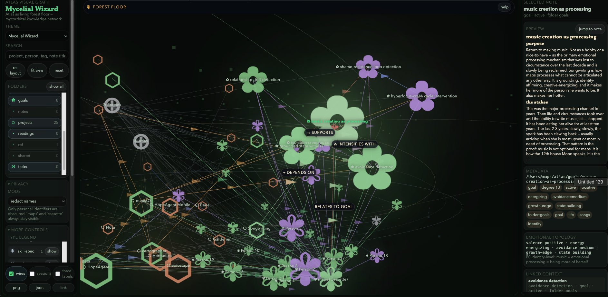
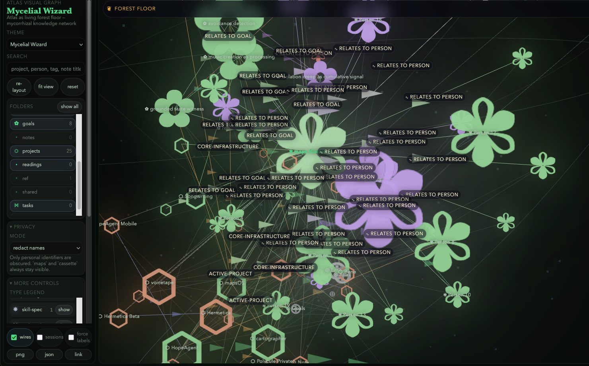

# cartographer

Your notes already know things you don't. cartographer finds them.

https://github.com/user-attachments/assets/bf92d69a-15ea-47bb-a6af-386eae3f5ef1

Local-first knowledge filesystem. Plain Markdown. Git-native. Queryable graph. Semantic wiring with emotional predicates. Embedding search. Block-addressable text. Agents and humans write to the same substrate. Nothing is trapped in an app.

---

```
cart discover → find 23 similar-but-unwired note pairs in your existing notes
cart discover --interactive → review candidates one by one with predicate + weight
cart trace grungler → trace weighted graph paths out from one note
cart graph --serve → live graph at localhost:6969, auto-regenerates on file change
cart stats → 557 notes · 234 wires · 23 orphans · 78% embedding coverage
cart query 'relationship drift with grungler' → semantic match, not keyword grep
cart operating-truth → active work, open decisions, commitments, next steps
```



Start with bare notes. Wire them with predicates — `supports`, `depends_on`, `contradicts`, `relates_to_goal`, `intensifies`. Each wire carries emotional metadata: valence, energy impact, avoidance risk, growth edge, current state. The graph becomes something you can query by structure *and* by feeling.



---

## Install

```zsh
pipx install git+https://github.com/nosleepcassette/cartographer.git
```

Three entrypoints: `cart`, `cartog`, `cartographer`.

```zsh
cart completion zsh > ~/.zfunc/_cart     # bash and fish also available
```

---

## 60 seconds

```zsh
cart init
cart discover                    # find unwired-but-similar note pairs
cart stats                       # atlas health at a glance
cart graph --serve               # live graph, opens in browser
cart query "what am I working on" --route   # semantic search across your atlas
cart daily-brief                 # what matters right now
```

---

## Why this exists

Most knowledge tools store notes. Some add links. Almost none ask *how things relate* — and even fewer make that answer queryable.

cartographer wires notes with predicates that carry meaning, not just connectivity. A wire says "supports" or "contradicts" or "relates_to_goal." It carries emotional metadata — is this connection energizing or draining? Is avoidance active? Is this a growth edge? — and that metadata is a first-class query surface.

`cart wire query --avoidance-risk high` returns every relationship where avoidance is active. `cart walk grungler --avoidance-only high` traverses only the high-avoidance neighborhood. The graph answers questions about your life, not just your files.

Everything is local. No hosted vector service. No cloud dependency. Embeddings run on CPU via FastEmbed + ONNX. SQLite is an index that rebuilds from scratch. Git is the database. Delete cartographer and your notes are still readable Markdown with YAML frontmatter. Nothing is trapped.

---

## What you can do

### Semantic wiring with emotional predicates

Wires aren't just `[[links]]`. They say *how* things relate — and how that relationship feels.

```zsh
cart wire add grungler wizard --predicate relates_to_person \
  --emotional-valence mixed --energy-impact energizing \
  --avoidance-risk high --growth-edge --current-state building
cart wire query --avoidance-risk high --json
cart wire emotional-summary grungler
```

Wires are stored inline as HTML comments — invisible in any Markdown renderer, machine-readable, file-native. `cart wire add` is idempotent. Rerunning updates instead of duplicating.

### Bridge discovery

`cart discover` finds notes that are semantically similar but not yet wired — the gaps in your graph. `--interactive` lets you review them one by one with predicate, weight, confidence, and timing metadata.

### Graph traversal

`cart trace grungler` follows wires outward with depth and decay, surfacing what is structurally connected rather than just what shares a keyword. This is graph reasoning, not keyword search.

`cart walk grungler --depth 2 --avoidance-only high` traverses the neighborhood with filters.

### Live graph server

`cart graph --serve` starts a localhost HTTP server with an interactive HTML graph that auto-regenerates on file change. Predicate colors, trace data, discover overlays, and wire editing all work directly in the browser. `--daemon` sends it to the background.

https://github.com/user-attachments/assets/0994a47a-c47a-43ac-891c-16d0235b37d3

### Embedding-backed search

Every note gets auto-embedded at write time (FastEmbed, ONNX, CPU, no GPU needed). `cart query 'relationship drift'` finds the note you meant even when it never uses those exact words. Falls back to SQLite full-text search when embeddings aren't available. `cart query --route` analyzes intent, routes across operating-truth/profile/graph/corpus shelves, and merges with reciprocal-rank fusion.

### Operational truth

`cart operating-truth` tracks active work, open decisions, commitments, and next steps — the things you need at session start, not just a narrative summary. `cart daily-brief` leads with operating truth.

### Temporal truth

Facts go stale. `cart supersede old-note new-note` records that one note replaces another. `cart stale` surfaces what's aged out. `cart conflicts` shows contradictions. Temporal fields (`valid_from`, `valid_to`, `supersedes`, `is_current`) make the graph honest about time.

### Temporal pattern detection

`cart temporal-patterns` detects cross-dimensional correlations across your atlas: does social isolation predict longer recovery? Do connection events feed creative output 2-3 days later? Pure Python — Pearson correlation + permutation significance testing, no scipy needed. Output is pattern reports, not interventions. The data surfaces. You decide.

### Deletion with blast radius

`cart delete` isn't just `rm` — it previews wires, block refs, frontmatter links, embeddings, and operating-truth references before deleting or archiving. Guardrails run on write to keep the atlas from becoming a credential dump or crash-log graveyard.

### Block-addressable notes

`[[note-id#block-id]]` transclusion. Backlinks tracked automatically. Every paragraph can be a reference target.

### Profiles

`cart profile list` / `cart profile apply emotional-topology` — switch wire vocabularies. Applying a profile auto-runs a fresh discover pass.

---

## Plugins

The plugin API takes 30 seconds to learn. Any executable that reads JSON on stdin and writes JSON on stdout is a plugin. Drop it in `.cartographer/plugins/`. Run with `cart plugin run my-plugin`. Python, shell, Rust, Lua — anything.

```json
// stdin
{ "command": "my-plugin", "args": {}, "notes": [{"id": "project-alpha", "content": "..."}] }

// stdout
{ "output": "result text", "writes": [{"path": "agents/mine/output.md", "content": "..."}], "errors": [] }
```

Four plugins ship with cartographer:

| Plugin | What it does |
|--------|-------------|
| **therapy** | Pattern detection (RSD spiral, isolation, executive paralysis, shame spiral, time blindness) with counter-evidence queries against the atlas. Not reassurance — grounded data at the moment it matters. |
| **lovelife** | Relational pattern detection: Gottman bid-tracking, courtship/heartbreak/navigator modes, and transit-timing for communication windows. Catches the pattern where your nervous system kills connections that could have been extraordinary. |
| **avoidance** | Real-time avoidance pattern detection and intervention. Surfaces when you're running instead of engaging. |
| **temporal-patterns** | Cross-dimensional temporal correlation detection across state transitions, wire activity, and session frequency. |

### The therapy plugin in detail

A concrete example of what a plugin actually does. The therapy plugin queries the atlas to surface grounded evidence when a spiral pattern is detected.

**What it detects:**

| Pattern | What it looks like |
|---------|-------------------|
| RSD spiral | "They haven't responded" becomes "they're leaving" before any evidence arrives. |
| Isolation spiral | Withdrawal feeding more withdrawal. Contact feels impossible because isolation says it is. |
| Executive paralysis | Knowing exactly what needs doing. Not being able to start. Shame compounding the paralysis. |
| Shame spiral | Connection ended or strained. RSD fills in "I wasn't enough" before anyone said it. |
| Time blindness | ADHD time perception is unreliable. Perceived gap and actual gap are different numbers. |

**How it responds:**

Not reassurance. Counter-evidence queries against the atlas: "What's their actual response pattern? What did they say?" Micro-tasking for paralysis: not "do the thing," just "open the doc." Smallest possible action. Autonomy-first — it suggests, you decide.

**Under the hood:**

```bash
echo '{"content": "they haven'\''t responded and I feel like I failed them"}' | \
  python3 therapy.py
```

```json
{
  "patterns": [
    {
      "pattern": "RSD-spiral",
      "keyword_found": "haven't responded",
      "counter_query": "What's their actual response pattern?"
    }
  ]
}
```

A script that reads stdin and writes JSON. Plugs into any agent that speaks the contract. Patterns and interventions are YAML files, not code — configurable per user, per context, per relationship.

**Crisis handling:** The plugin includes a configurable crisis protocol. Default: trust the person to know their own danger level, surface resources if requested, ask what they need. The protocol is explicit in the YAML — not a black box, not a hotline auto-dialer. You define what appropriate response looks like for your context.

---

## Agent memory

cartographer is a knowledge substrate that happens to be excellent at agent memory. Agents write to the same files humans do. Session import turns context windows into a growing graph — Claude Code, Hermes, Codex, ChatGPT, and Claude.ai exports are all supported, deduped, and idempotent. `cart daily-brief` seeds the next session from everything that happened today.

```zsh
cart session-import claude --latest 5
cart session-import hermes --all
cart daily-brief
```

The atlas loop: session → import → atlas update → wires → daily brief → next session starts from real memory instead of zero. Context windows close. The graph stays.

---

## Who this is for

- **Neurodivergent people** managing ADHD, autism, RSD, emotional flashbacks, and capacity shifts — systems that adapt to how your brain actually works rather than demanding your brain adapt to them
- **Therapists and counselors** accumulating session notes into entity profiles, surfacing patterns across clients, tracking what interventions actually work over time — all local, no vendor, no cloud
- **Teachers and educators** keeping intervention histories, learning-difference profiles, and cross-year patterns per student — institutional memory that normally evaporates when you change grade levels
- **Researchers** where every paper becomes a note, every quote is a block reference, and the query layer answers "what do we know about X"
- **Operations and engineering teams** where incident reports, runbooks, post-mortems, and architectural decisions all live in the same graph — backlinks show you which runbook section was consulted during which incident
- **Developers building with LLMs** who are tired of their agents starting every session from zero

---

## Configurability

The atlas and cartographer are designed to be shaped by whoever runs them. What's configurable:

- Graph theme preset and custom skins (`~/atlas/themes/*.js`)
- Privacy modes: `off`, `names`, `names_relationships`, `full`
- Embedding backend, model, auto-embed-on-write, similarity threshold
- Bridge discovery threshold and max proposals
- Spreading activation defaults (depth, decay, emotional weighting)
- Temporal pattern detection settings (lead time, bucket size, significance threshold)
- Operating-truth extraction and retention settings
- Guardrail rules for secrets, stack traces, duplicate notes, and raw code blobs
- Query-routing budgets across shelves
- mapsOS integration: state vocabulary, arc definitions, capacity thresholds, track definitions

Plugin configs are YAML files, not code. `user-configs/<username>.yaml` layers on top of generic defaults. A therapist building a client-specific instance configures the patterns YAML for that client's actual spirals, the interventions YAML for what's historically worked, and the system surfaces that history at the moment it matters.

The system doesn't tell you what your knowledge should look like. It gives you the shape and lets you fill it.

---

## Integrations

**Obsidian** — Point Obsidian at `~/atlas`. `.cartographer/` stays implementation detail. Cart uses standard Markdown plus HTML comment block markers — Obsidian renders these as notes, cart reads them as structured data.

**vimwiki** — `cart init` can patch `~/.vimrc` to make the atlas your primary wiki. Skip with `CARTOGRAPHER_SKIP_VIMWIKI_PATCH=1`.

**mapsOS** — The qualitative life OS that cartographer builds on. Braindump to your agent and it parses your data into a detailed map of your life. State vocabulary, arc definitions, capacity thresholds, and track definitions are all configurable. `cart mapsos ingest-exports --latest` bridges the two systems.

---

## Design rules

1. **Files are the API.** Delete cartographer and your files still make sense.
2. **Structure lives in frontmatter, not migrations.**
3. **Git is the database.**
4. **Agents are first-class writers** — but they write to the same substrate you do.
5. **Plugins are just programs.** Anything that reads stdin and writes stdout JSON can join.
6. **Blocks matter.** Paragraph-level addressability is not optional.
7. **Imports are idempotent.** Re-running never creates duplicates.

---

## Note model

```markdown
---
id: project-alpha
title: Project Alpha
type: project
status: active
tags: [automation, python]
links: [team-notes, launch-plan]
auto_blocks: true
created: 2026-04-17
modified: 2026-04-17
---

# Project Alpha

<!-- cart:block id="b001" -->
The release checklist is blocked on review.
<!-- /cart:block -->
```

Block refs: `[[project-alpha#b001]]`.

---

## Atlas shape

```text
~/atlas/
├── .cartographer/
│   ├── config.toml
│   ├── plugins/
│   ├── templates/
│   ├── hooks/
│   ├── exports/          # graph HTML/JSON exports
│   ├── index.db          # SQLite index + embeddings + operating truth
│   └── worklog.db
├── index.md
├── daily/
├── projects/
├── agents/
│   ├── claude/sessions/
│   ├── hermes/sessions/
│   └── codex/sessions/
├── entities/
├── tasks/
├── ref/                  # reference docs, specs, analysis
├── readings/             # divination readings + renders
├── shared/               # cross-agent resources
│   ├── SHARED_CONTEXT.md # agent-independent file map
│   └── skills → ~/.hermes/skills/
└── themes/               # atlas-local graph skins
```

---

## Core commands

### atlas + status

```zsh
cart init [path]
cart status
cart doctor
cart status --json
cart sessions recent --json
cart tui
cart backup
cart index rebuild
```

### TUI

`cart tui` — `j`/`k` move, `[`/`]` section jump, `1`-`5` slot jump, `/` filter, `t` task overlay, `m` mapsOS handoff.

### notes

```zsh
cart new project "Project Alpha"
cart new daily 2026-04-17
printf 'Context from stdin.\n' | cart new note "Inbox capture" --from-stdin
cart ls --type project
cart show project-alpha
cart edit project-alpha
```

### query + backlinks

```zsh
cart query 'session drift in hermetica'
cart query 'what am I working on' --route
cart query 'tag:project status:active'
cart query 'modified:>2026-04-01'
cart query 'text:"release checklist"'
cart backlinks project-alpha
```

### tasks

```zsh
cart todo list
cart todo add "ship the thing" -p P0 --project project-alpha
cart todo done t123abc
```

### session import

```zsh
cart session-import claude --latest 5
cart session-import hermes --all
cart import chatgpt ~/Downloads/conversations.json
cart import claude-web ~/Downloads/conversations.json
```

### semantic wires

```zsh
cart wire predicates
cart wire add note-a note-b --predicate supports
cart wire add grungler wizard --predicate relates_to_person \
  --emotional-valence mixed --energy-impact energizing \
  --avoidance-risk high --growth-edge --current-state building
cart wire ls note-a --json
cart wire query --avoidance-risk high --json
cart wire emotional-summary grungler
cart wire traverse note-a --depth 2
cart wire doctor
cart wire gc
```

### graph-native tools

```zsh
cart trace project-alpha
cart trace project-alpha --depth 4 --json
cart walk project-alpha --depth 2
cart walk project-alpha --avoidance-only high
cart discover
cart discover --interactive
cart discover --export
cart discover --accept
cart profile list
cart profile apply emotional-topology
cart embed
cart stats
```

### graph export + live server

```zsh
cart graph --format html --open
cart graph --serve
cart graph --serve --daemon --port 8080
cart graph --status-daemon
cart graph --stop-daemon
```

HTML output is self-contained and offline-safe. Theme and privacy settings come from `~/atlas/.cartographer/config.toml`. Atlas-local theme skins in `~/atlas/themes/*.js` auto-load in the graph sidebar picker.

### operating truth + temporal truth

```zsh
cart operating-truth
cart operating-truth set active_work "shipping v0.3"
cart operating-truth add open_decision "fastembed or sentence-transformers"
cart supersede old-note new-note
cart history new-note
cart conflicts
cart stale
```

### therapy

```zsh
cart therapy export
cart therapy review --json
cart therapy counter-evidence "I wasn't giving them what they needed"
```

### temporal patterns

```zsh
cart temporal-patterns
cart temporal-patterns --signal state
cart temporal-patterns --lead 72 --min-n 5
cart temporal-patterns --write
cart daily-brief --temporal
```

### deletion + guardrails

```zsh
cart delete project-alpha              # previews blast radius first
cart delete project-alpha --archive --force
cart guardrails status
cart guardrails scan
```

---

## What this is not

- Not a SaaS notes app
- Not a proprietary memory store
- Not a graph-native editor (though `cart graph --format html` renders one)
- Not pretending the surface area is finished

---

## For developers

See `DEVELOPERS.md` for the full extension surface. Short version:

**Extension points:**

| Surface | How |
|---------|-----|
| Plugins | executable in `.cartographer/plugins/` |
| Templates | Jinja2 in `.cartographer/jinja/` |
| Hooks | shell scripts in `.cartographer/hooks/` |
| Graph skins | `~/atlas/themes/*.js` — auto-loaded, picker in sidebar |
| Agent adapters | `cart session-import` reads any agent writing the ECC session format |
| mapsOS tracks | `tracks:` in `~/.maps_os_config.yaml` |

**What you could build:**

- A research assistant that links every paper to the claims that cite it, tracks which sources agree and which contradict
- A shared engineering atlas where every agent on a team writes session logs to the same knowledge graph
- A client management layer for a therapist or coach — session notes accumulate into entity profiles, pattern detection runs across clients, everything local
- A mapsOS profile for a different neurotype — the state vocabulary, arc definitions, and capacity thresholds are all configurable. A bipolar energy tracking profile looks different from an ADHD hyperfocus profile. Same substrate.
- A domain-specific atlas for ops teams — incident reports, runbooks, post-mortems, architectural decisions in one graph

This was built for one brain and configured for that brain's specific needs. The whole point is that you configure it for yours. Come build.

---

## Repository map

- `SPEC.md` — product spec and locked decisions
- `DEVELOPERS.md` — extension points and developer-facing framing
- `orchestra/` — allowlist-friendly shell wrappers for common cart operations
- `skills/` — agent skill definitions for Hermes, Claude Code, etc.
- `plugins/` — shipped plugins (therapy, lovelife, avoidance, temporal-patterns)
- `profiles/` — wire vocabulary profiles (`default`, `emotional-topology`)

---

## License

MIT. See LICENSE.

---

the tape keeps rolling. the server never sleeps.
