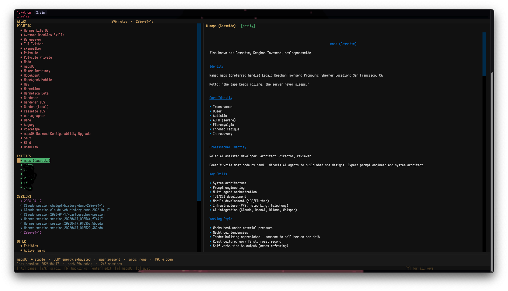
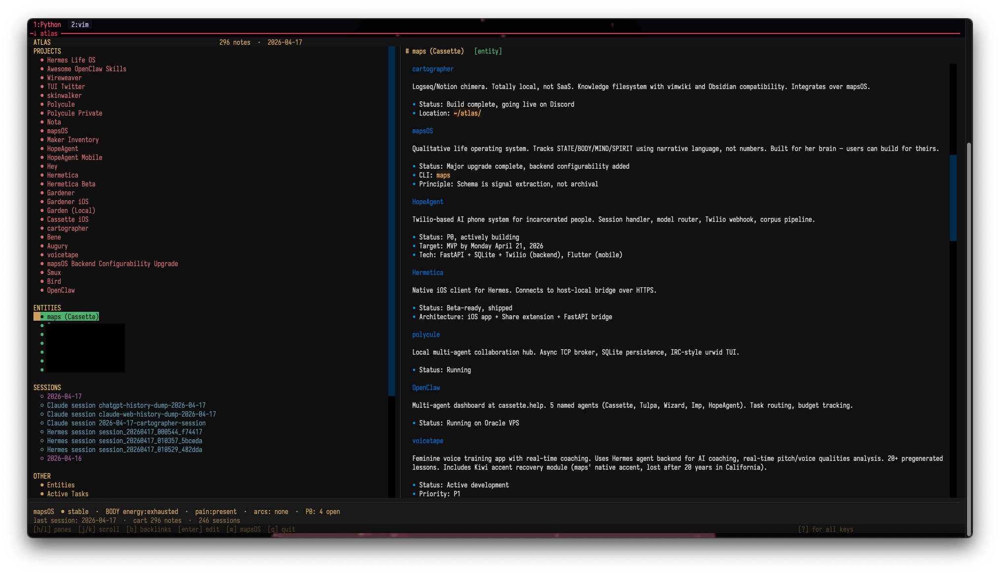
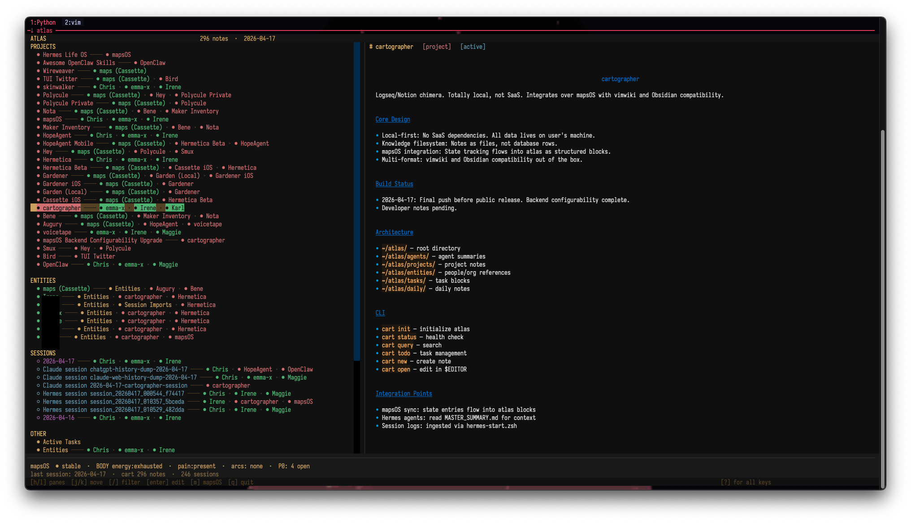
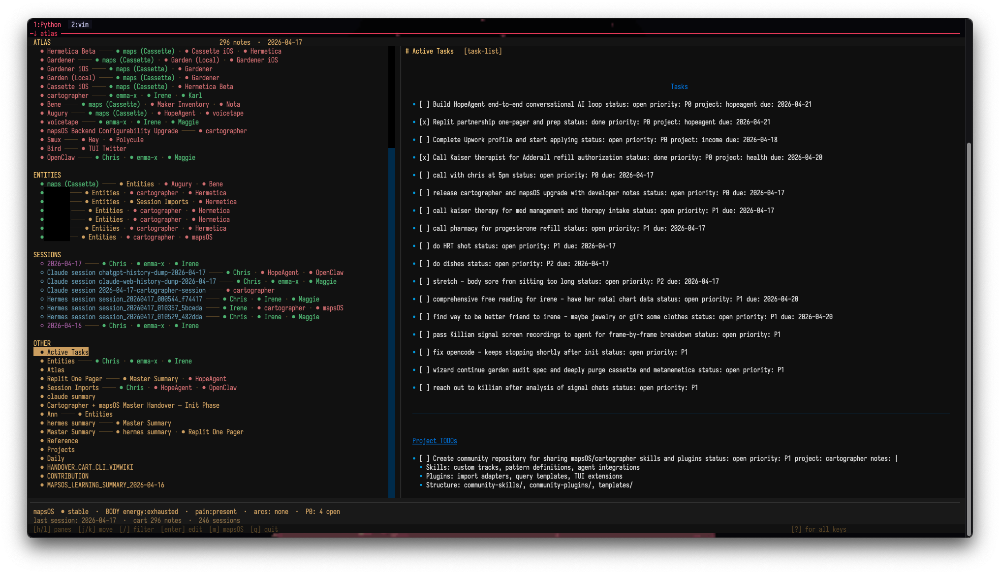

# cartographer

> Your agents should know how you're actually doing - and remember everything they learn.

Local-first knowledge filesystem and agent memory layer.

Plain Markdown. Git history. Queryable graph. Block-addressable text.
Agents and humans write to the same substrate. Nothing is trapped in an app.

<table>
<tr>
<td align="center"><br><sub>atlas TUI — graph pane + note view</sub></td>
<td align="center"><br><sub>block transclusion rendering</sub></td>
</tr>
<tr>
<td align="center"><br><sub>mapsOS state strip + task overlay</sub></td>
<td align="center"><br><sub>entity profile with backlinks</sub></td>
</tr>
</table>

<sub>_Note: Entity names censored for public release._</sub>

---

Someone on Discord, after seeing an early scope sheet, wrote:
*"maybe under an orchestrator project (atlas?)"*

They arrived at the architecture without knowing it already existed.
That's the idea.

**atlas** is the substrate. cartographer is what builds and queries it.
mapsOS is what keeps it honest about how you're actually doing.

---

## why this is different

Most knowledge tools ignore AI entirely. Most AI tools ignore your history.
cartographer assumes both exist and treats them as first-class:

- **Agent memory persists.** Session import turns context windows into a growing graph. `cart daily-brief` seeds tomorrow's session from everything that happened today.
- **Files are the API.** Delete cartographer. Your notes are still readable Markdown with YAML frontmatter. Git is the database. SQLite is an index, not a prison.
- **Block-addressable by default.** `[[note-id#block-id]]` transclusion. Backlinks tracked automatically. The relational layer Obsidian promised but never fully delivered.
- **Imports are idempotent.** Run `cart session-import` a hundred times. Zero duplicates. Just an always-current graph.
- **Optional semantic search without lock-in.** If `qmd` is installed, plain-language `cart query` can use hybrid retrieval over the atlas. If not, cart stays on its built-in SQLite/FTS path.
- **Built for neurodivergent workflows.** Qualitative state tracking, capacity-aware context, honest about when you're not okay. Paired with mapsOS. Configurable for any brain.
- **Plugin economy.** stdin/stdout JSON contract. If it speaks that, it joins. The long-term goal is Vim-scale extensibility.

---

## what shipped in this push

This is the release where atlas starts to feel like a real operating surface instead of just a filesystem plus commands.

- **A real atlas interface.** `cart tui` gives you a Textual TUI with a structured graph pane, a native graph-focus view, collapsible groups, note rendering, backlinks, tasks overlay, and vim-style movement.
- **mapsOS handoff is built in.** Hit `m` from the cartographer TUI to drop into mapsOS. Hit `C` in mapsOS to come back. mapsOS exports ingest back into the atlas on exit.
- **State is visible inside memory now.** The atlas TUI reads the latest mapsOS export directly and shows current qualitative state, active arcs, and open P0 load in the state strip.
- **The system is more clearly one thing.** mapsOS is the qualitative layer. cartographer is the memory and task layer. atlas is the substrate underneath both.
- **The developer framing is explicit.** This repo is not just "my notes tool." It is infrastructure for agents, plugins, shared memory, and weird local-first systems that need durable context.

---

## current status

**Phase 4 is live.** The closed loop is local and usable:

```text
session -> export -> cart ingest -> atlas update -> daily brief -> next session
```

### implemented

- Atlas initialization (`cart init`)
- Markdown notes with YAML frontmatter
- SQLite indexing for full-text search
- Block insertion and addressing
- Block transclusion rendering in the atlas TUI
- Task CRUD with priorities
- Plugin system (JSON stdin/stdout)
- Session import: Claude Code, Hermes, Codex (deduped)
- External import: ChatGPT, Claude.ai conversation exports
- Graph export: all notes as nodes, all links as edges (JSON)
- Visual knowledge graph HTML export with local search, pan/zoom, dragging, and node inspection
- Optional qmd-backed plain-language atlas search
- CLI health + JSON surfaces via `cart doctor`, `cart status --json`, `cart sessions recent --json`, and JSON task/query output
- Textual atlas TUI (`cart tui`) with graph navigation, native graph-focus rendering, collapsible groups, note rendering, backlinks, tasks overlay, and mapsOS handoff
- mapsOS bridge: ingest exports, synthesize patterns, and read state back into the atlas surface
- Daily brief generation
- Learning audit loop

### still moving

- Concurrent write protection under heavier multi-agent load
- Model-backed summary backends
- Richer shared-atlas and multi-user workflows
- Deeper mapsOS task write-back

---

## atlas shape

```text
~/atlas/
├── .cartographer/
│   ├── config.toml
│   ├── plugins/
│   ├── templates/
│   ├── index.db        # SQLite index, NOT the source of truth
│   └── worklog.db
├── index.md
├── daily/
├── projects/
├── agents/
│   ├── claude/sessions/
│   ├── hermes/sessions/
│   └── codex/sessions/
├── entities/
├── tasks/
└── ref/
```

---

## install

```zsh
pipx install git+https://github.com/nosleepcassette/cartographer.git
```

Or from checkout:

```zsh
cd ~/dev/cartographer
pipx install -e .
```

Three equivalent entrypoints: `cart`, `cartog`, `cartographer`.

### shell completion

Cart can print native completion scripts for Bash, Zsh, and Fish:

```zsh
cart completion zsh > ~/.zfunc/_cart
autoload -Uz compinit && compinit
```

Other common setups:

```bash
cart completion bash > ~/.local/share/bash-completion/completions/cart
cart completion fish > ~/.config/fish/completions/cart.fish
```

---

## quickstart

```zsh
cart init
cart status
cart doctor
cart daily-brief
cart sessions recent --json
cart tui
cart session-import claude --latest 1
```

---

## core commands

### atlas + status

```zsh
cart init [path]
cart status
cart doctor
cart status --json
cart sessions recent --json
cart tui
cart backup
cart index rebuild
```

### notes

```zsh
cart new project "Project Alpha"
cart new daily 2026-04-17
cart ls --type project
cart show project-alpha
cart edit project-alpha
```

### query + backlinks

```zsh
cart query 'session drift in hermetica'   # plain language; prefers qmd when configured
cart query 'tag:project status:active'
cart query 'modified:>2026-04-01'
cart query 'text:"release checklist"'
cart query --json 'type:agent-log'
cart backlinks project-alpha
```

Plain-language queries stay atlas-scoped. Cart only uses qmd when it can map the atlas root to a qmd collection; otherwise it falls back to the built-in index automatically.

### optional enhanced search with qmd

```zsh
npm install -g @tobilu/qmd
cart qmd bootstrap
cart query 'what do we know about Chris'
```

What this does:

- creates or reuses a qmd collection pointing at your atlas root
- writes `qmd.default_collection` into `~/atlas/.cartographer/config.toml`
- runs `qmd embed` once so future plain-text `cart query` calls can use hybrid retrieval

Structured cart queries still use the built-in engine:

```zsh
cart query 'type:project tag:income'
cart query 'text:"Twilio" modified:>2026-04-01'
```

### tasks

```zsh
cart todo list
cart todo add "ship the thing" -p P0 --project project-alpha
cart todo done t123abc
cart todo query 'priority:P0 status:open'
cart todo query --json 'status:open'
```

### session import

```zsh
cart session-import claude --latest 5
cart session-import hermes --all
cart session-import claude --force
cart sessions recent
cart sessions recent --agent hermes --json
```

### external import

```zsh
cart import chatgpt ~/Downloads/conversations.json
cart import claude-web ~/Downloads/conversations.json
```

Both support `--latest N` and `--force`. All imports are deduped.

### graph export

```zsh
cart graph --export
cart graph --format html
cart graph --format html --open
```

JSON output: `{nodes: [{id, title, type, tags}], edges: [{source, target}]}`

HTML output is a self-contained visual graph with:

- type-colored nodes
- degree-scaled sizing
- local search by note title, id, type, or tag
- pan/zoom, dragging, and a detail pane for the selected node

### mapsOS bridge

```zsh
cart mapsos ingest-exports --latest
cart mapsos patterns --field state
cart daily-brief
```

Inside the TUIs:

- `cart tui` -> `m` launches mapsOS
- `maps` -> `C` launches cartographer
- quitting mapsOS ingests the latest export back into the atlas when `cart` is available

---

## atlas loop

```text
agent session
  -> session import
  -> atlas note + links + tasks + learnings
  -> mapsOS export ingested as qualitative state
  -> daily brief
  -> next session starts from real memory instead of zero
```

This is the core promise of the project: context windows close, but the graph stays.

---

## Agent Skills

For AI agents working with cartographer/atlas, we publish skill definitions:

| Skill | Description | Gist |
|-------|-------------|------|
| **Cartographer Init** | Initialize atlas directory, install CLI, run status check | [View Gist](https://gist.github.com/nosleepcassette/96f39bb9637dba100a9f4e4f66900f3e) |
| **Cartographer Query** | Search syntax for tag, status, type, links, text queries | [View Gist](https://gist.github.com/nosleepcassette/05374920e0c2f976f02999532208df1f) |
| **Cartographer Summary** | Generate and maintain MASTER_SUMMARY.md from context sources | [View Gist](https://gist.github.com/nosleepcassette/e1f9a62546752bebd7afca62a9023f83) |
| **Cartographer Todo** | Task management with P0-P3 priorities, project linking | [View Gist](https://gist.github.com/nosleepcassette/7983da390c33fb91ad8d904e55de671c) |

These skills encode:
- CLI commands and workflows
- Query syntax and composable patterns
- Master summary generation protocol
- Task block format and integration with mapsOS

To use in Hermes Agent: place in `~/.hermes/skills/cartographer*/`

To use in Claude Code: add to CLAUDE.md or import via MCP.

---

## Community Skills & Plugins

**TODO:** Community repository for sharing cartographer plugins, import adapters, query templates, and agent integrations.

If you've built something with cartographer — an import adapter, a query template, a plugin — we want to surface it.

---

## design rules

1. **Files are the API.** Delete cartographer and your files still make sense.
2. **Structure lives in frontmatter, not migrations.**
3. **Git is the database.**
4. **Agents are first-class writers.**
5. **Plugins are just programs.** Anything that reads stdin and writes stdout JSON can join.
6. **Blocks matter.** Paragraph-level addressability is not optional.
7. **Imports are idempotent.** Re-running never creates duplicates.

---

## note model

```markdown
---
id: project-alpha
title: Project Alpha
type: project
status: active
tags: [automation, python]
links: [team-notes, launch-plan]
auto_blocks: true
created: 2026-04-17
modified: 2026-04-17
---

# Project Alpha

<!-- cart:block id="b001" -->
The release checklist is blocked on review.
<!-- /cart:block -->
```

Block refs: `[[project-alpha#b001]]`.

---

## plugin contract

Plugins live in `.cartographer/plugins/`. They're just executables.

**Input (stdin):**
```json
{
  "command": "summarize",
  "args": {"max_words": 300},
  "notes": [{"id": "project-alpha", "content": "..."}]
}
```

**Output (stdout):**
```json
{
  "output": "...",
  "writes": [{"path": "agents/hermes/SUMMARY.md", "content": "..."}],
  "errors": []
}
```

Python, shell, Lua, anything that speaks JSON on stdin/stdout.

Machine-readable CLI surfaces now include top-level `schema_version` and `surface` fields so bridge clients can validate what they are consuming over time.

---

## hermes integration

cartographer is the canonical memory layer for Hermes agents:

- **Session import:** `cart session-import hermes --all`
- **Learning capture:** `cart learn "observation" --topic slug`
- **Daily brief:** Loaded at session start via `cart daily-brief`
- **Context awareness:** See `skills/context-awareness/SKILL.md` in the Hermes profile

When Hermes learns something durable, it writes to the atlas. When it starts a session, it reads from the atlas. No invisible memory. No context loss between sessions.

---

## integrations

### vimwiki

`cart init` can patch `~/.vimrc` to make the atlas your primary wiki. Skip with:

```zsh
export CARTOGRAPHER_SKIP_VIMWIKI_PATCH=1
```

### obsidian

cartographer uses Markdown plus HTML comment block markers. Point Obsidian at `~/atlas`. `.cartographer/` stays implementation detail.

### developers

See `DEVELOPERS.md` for the plugin contract, extension points, and what to build on top of the atlas substrate.

Short version:

- Build agent plugins that read atlas context and write durable memory back.
- Build domain-specific atlas stacks for research, teams, therapy, operations, or neurodivergent life management.
- Build new surfaces on top of the files-and-graph layer instead of starting from another silo.

Repos:

- cartographer: <https://github.com/nosleepcassette/cartographer>
- mapsOS: <https://github.com/nosleepcassette/mapsOS>

---

## what this is not

- Not a SaaS notes app
- Not a proprietary memory store
- Not a graph-native editor, even though `cart graph --format html` now renders one
- Not pretending the surface area is finished

---

## repository map

- `SPEC.md` - product spec and locked decisions
- `AGENT_ONBOARDING.md` - context for any agent joining the system
- `AGENT_DISPATCHER.md` - routing protocol for multi-agent handoff and anti-recursion
- `CART_PHASE3_SPEC.md` - phase 3 implementation record
- `CART_PHASE4_SPEC.md` - deferred deep-sync and robustness work
- `CART_PHASE5_SPEC.md` - scoped CLI and TUI upgrade plan
- `CART_PHASE5_BUILDSHEET.md` - implementation order for the next cart upgrade
- `CART_MODEL_SUMMARIES_SPEC.md` - next-pass summary profiles, provenance, and cache rules
- `CART_RUNTIME_AUTOMATION_SPEC.md` - scoped hooks, validation, notification, and registry upgrades
- `CART_VISUAL_GRAPH_V1_SPEC.md` - shipped first-pass visual graph scope
- `MAPSOS_BRIDGE_V2_SPEC.md` - structured bridge contract for cartographer and mapsOS
- `QMD_OPTIONAL_SPEC.md` - implementation notes for optional qmd search
- `orchestra/` - short allowlist-friendly shell wrappers for common cart operations
- `skills/create-skill/SKILL.md` - guided conversation for drafting new Claude skills
- `DEVELOPERS.md` - extension points and developer-facing framing

---

## license

MIT. See LICENSE.

---

the tape keeps rolling. the server never sleeps.
